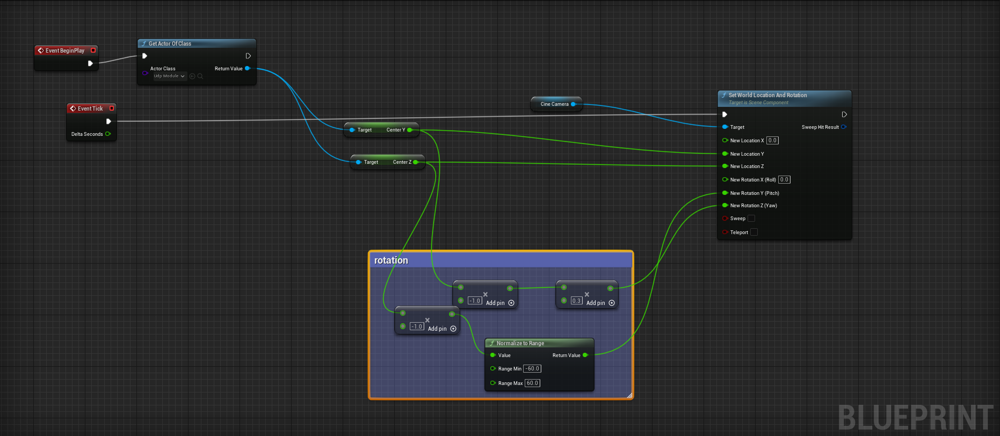

# Face-track-unreal-engine
Using face tracking moving camera inside the unreal engine in real-time.

#How to Use-  
1)First install python library that needed using - ``` pip install -r requirements.txt ```.  
2)In the python script change the VideoCapture device Set 0 ```cv2.VideoCapture(0)``` if using webcam here I'm using remote camera feed.  
3) Create Unreal project with c++ and open project in Visual Studio , add this dependencies inside your **Build.cs** file in this line- 
``` PublicDependencyModuleNames.AddRange(new string[] { "Core", "CoreUObject", "Engine", "InputCore", "HeadMountedDisplay", "NavigationSystem", "AIModule", "Networking", "Sockets", "InputCore" }); ```.  
4) After this first build project , you can add the udp_module.cpp & udp_module.h files in source code or you can manually add the c++ class and then write this code. After this build the project add the actor in your scene.
5) Create a Blueprint in unreal using pawn as a parent and add cinecamera as component compile and in even graph add this setup in image below and compile then add this Blueprint in you scene.  
.  
4)Start python script and play the level in unreal thats it now you can move camera inside unreal engine using face tracking , you can change it further to change camera settings etc.  
